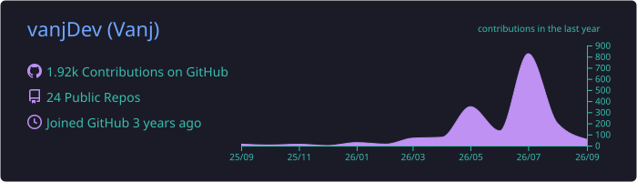
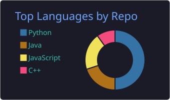
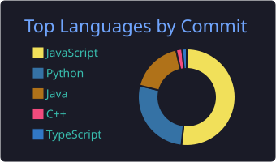
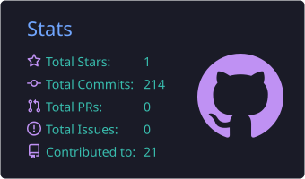
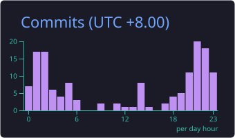

## About

I like building small, useful software that turns repetitive work into something cleaner and easier to use. My projects lean toward Python utilities, JavaScript apps, school systems, automation helpers, and experiments around game/server tooling.

- Building practical tools with Python and JavaScript
- Exploring C++, Java, and Lua through projects and coursework
- Keeping projects simple, readable, and useful before making them fancy

## Tech Stack

  

## Featured Projects

| Project | What it shows | Stack |
| --- | --- | --- |
| [FEUTech-GPACalc](https://github.com/vanjDev/FEUTech-GPACalc) | GPA calculation workflow with a focused student use case | JavaScript |
| [Lumen](https://github.com/vanjDev/Lumen) | Python project work and backend/tooling practice | Python |
| [AutoFGLUT](https://github.com/vanjDev/AutoFGLUT) | Visual Studio FreeGLUT setup automation for C++ projects | Python, C++ tooling |
| [Better-YT-MP3](https://github.com/vanjDev/Better-YT-MP3) | YouTube audio search/download utility optimized for MP3 playback | Python |
| [BudgetTracker](https://github.com/vanjDev/BudgetTracker) | Personal finance tracking app experiment | Python |

## GitHub Activity

  

  
  

  
  

## Contribution Trail

<picture>
  <source media="(prefers-color-scheme: dark)" srcset="https://raw.githubusercontent.com/vanjDev/vanjDev/output/github-contribution-grid-snake-dark.svg">
  <source media="(prefers-color-scheme: light)" srcset="https://raw.githubusercontent.com/vanjDev/vanjDev/output/github-contribution-grid-snake.svg">
  
</picture>

## Current Direction

I am sharpening my fundamentals while building projects that solve real problems: cleaner automation, better student tools, useful desktop/web utilities, and more reliable project structure.

`build small` -> `make it useful` -> `make it clean`

