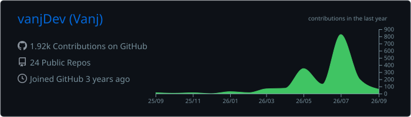

<div align="center">


# Hey, I'm Jhevan.

I build useful web products, automation, and developer tools—then keep refining them until they feel simple.

[](https://byvanj.com)
[](https://bot.byvanj.com)

<sub>Student developer · product builder · based in the Philippines</sub>

</div>

## What I'm building

| | Project | What it does |
| :---: | --- | --- |
| 🤖 | **[byvanj bot](https://bot.byvanj.com)** | A no-code Discord bot builder. Pick features, configure them in a web dashboard, and run the bot on a fast multi-bot runtime—no programming required. |
| ◈ | **[byvanj.com](https://byvanj.com)** | My interactive portfolio and project index, built with React, TypeScript, Three.js, and motion-driven UI. |

## Selected work

- **[OptiMD](https://github.com/vanjDev/OptiMD)** — packages long PDF and DOCX files as clean, chunked, traceable Markdown for AI workflows.
- **[SOLAR Evaluation Helper](https://github.com/vanjDev/solar-survey-helper)** — a privacy-minded Chrome extension that fills supported evaluation controls while leaving submission manual.
- **[ThesisBot](https://github.com/vanjDev/ThesisBot)** — a Discord productivity bot for thesis tasks, deadlines, notes, progress, reminders, and a local dashboard.

## How I work

```text
find the friction  →  build the useful version  →  test the edges  →  polish the experience
```

Most of my projects sit where product thinking meets practical engineering: Python services, React interfaces, Go runtimes, Discord automation, image tooling, and deployment work.

<p align="center">
  
</p>

## GitHub activity

<p align="center">
  
</p>

<picture>
  <source media="(prefers-color-scheme: dark)" srcset="https://raw.githubusercontent.com/vanjDev/vanjDev/output/github-contribution-grid-snake-dark.svg">
  <source media="(prefers-color-scheme: light)" srcset="https://raw.githubusercontent.com/vanjDev/vanjDev/output/github-contribution-grid-snake.svg">
  
</picture>

<div align="center">


**Build useful things. Make them feel good to use.**

</div>
