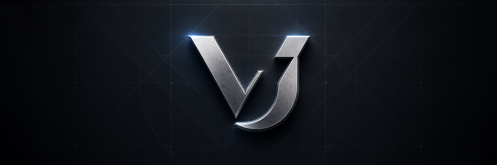

# Hey, I'm Jhevan.

I build web products, automation, and developer tools that make complicated work feel simple.

Student developer · product builder · based in the Philippines

## Building now

- **[byvanj bot](https://bot.byvanj.com)** — a no-code Discord bot builder with a web dashboard and a Go runtime for running multiple bots.
- **[byvanj.com](https://byvanj.com)** — my interactive portfolio and project index, built with React, TypeScript, and Three.js.

## Selected work

- **[OptiMD](https://github.com/vanjDev/OptiMD)** — turns long PDF and DOCX files into structured Markdown packages with chunks, images, tables, and traceable source files.
- **[SOLAR Evaluation Helper](https://github.com/vanjDev/solar-survey-helper)** — fills supported evaluation controls in Chrome while leaving submission in the user's hands.
- **[ThesisBot](https://github.com/vanjDev/ThesisBot)** — brings thesis tasks, deadlines, notes, and reminders into Discord and a local dashboard.

## What I work with

| Area | Tools |
| --- | --- |
| Interfaces | React, TypeScript, Vite, Tailwind CSS, Three.js |
| Services and automation | Python, Go, Discord bots |
| Shipping | Git, GitHub Actions, Linux, Nginx |

## How I work

Find the friction → build the useful version → test the edges → polish the experience.

## GitHub activity

<picture>
  <source media="(prefers-color-scheme: dark)" srcset="./profile-summary-card-output/github_dark/0-profile-details.svg">
  <source media="(prefers-color-scheme: light)" srcset="./profile-summary-card-output/github/0-profile-details.svg">
  
</picture>

<picture>
  <source media="(prefers-color-scheme: dark)" srcset="https://raw.githubusercontent.com/vanjDev/vanjDev/output/github-contribution-grid-snake-dark.svg">
  <source media="(prefers-color-scheme: light)" srcset="https://raw.githubusercontent.com/vanjDev/vanjDev/output/github-contribution-grid-snake.svg">
  
</picture>

**Build useful things. Make them feel good to use.**

