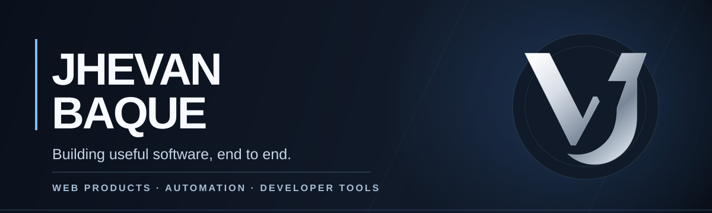
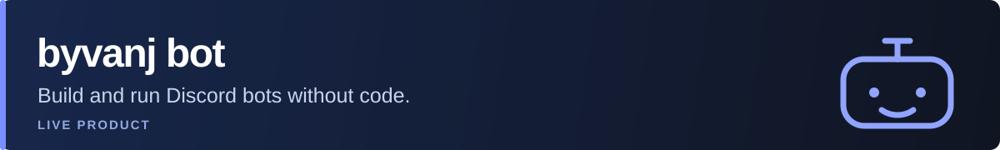
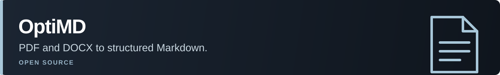
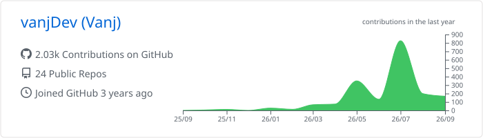
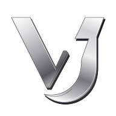

<picture>
  <source media="(max-width: 600px)" srcset="./assets/profile-hero-mobile.svg">
  
</picture>

 

I turn complicated workflows into products people can actually use.

**[Explore my portfolio](https://byvanj.com)** &nbsp;·&nbsp; **[Try byvanj bot](https://bot.byvanj.com)**

Student developer · product builder · based in the Philippines

## Featured builds

<a href="https://bot.byvanj.com"><picture><source media="(max-width: 600px)" srcset="./assets/featured-bot-mobile.svg"></picture></a>

<a href="https://github.com/vanjDev/OptiMD"><picture><source media="(max-width: 600px)" srcset="./assets/featured-optimd-mobile.svg"></picture></a>

## More of my work

- **[byvanj.com](https://byvanj.com)** — an interactive portfolio and project index built with React, TypeScript, and Three.js.
- **[SOLAR Evaluation Helper](https://github.com/vanjDev/solar-survey-helper)** — a Chrome extension that fills supported evaluation controls while leaving submission manual.
- **[ThesisBot](https://github.com/vanjDev/ThesisBot)** — thesis tasks, deadlines, notes, and reminders in Discord and a local dashboard.

## What I build with

**Interfaces** · React, TypeScript, Vite, Tailwind CSS, Three.js 
**Services & automation** · Python, Go, Discord bots 
**Shipping** · Git, GitHub Actions, Linux, Nginx

Find the friction → build the useful version → test the edges → polish the experience.

## GitHub activity

<picture>
  <source media="(prefers-color-scheme: dark)" srcset="./profile-summary-card-output/github_dark/0-profile-details.svg">
  <source media="(prefers-color-scheme: light)" srcset="./profile-summary-card-output/github/0-profile-details.svg">
  
</picture>

<picture>
  <source media="(prefers-color-scheme: dark)" srcset="https://raw.githubusercontent.com/vanjDev/vanjDev/output/github-contribution-grid-snake-dark.svg">
  <source media="(prefers-color-scheme: light)" srcset="https://raw.githubusercontent.com/vanjDev/vanjDev/output/github-contribution-grid-snake.svg">
  
</picture>

**Build useful things. Make them feel good to use.**

